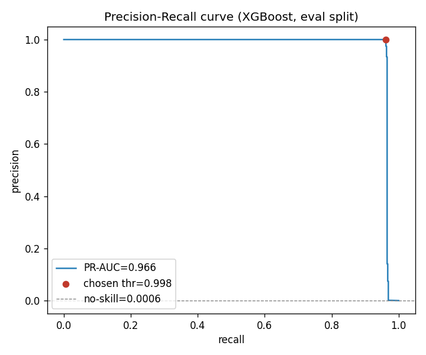

# Financial Fraud Detection

Fraud scorer for mobile-money transactions: ~6.36M PaySim-style records, ~0.13%
fraud. XGBoost with class weighting, a cost-aware decision threshold, and one
shared pipeline so training and serving can't drift.

**Live demo:** https://financial-fraud-detection-xqmssgyqc8vs3wpviqwkqx.streamlit.app/

## Results

Held-out production set (final ~1.36M rows, never used for training, selection, or
threshold tuning; scored once at threshold 0.90):

| metric | value |
|--------|-------|
| PR-AUC | 0.963 |
| ROC-AUC | 0.976 |
| precision | 0.998 |
| recall | 0.957 (0.991 on scoreable traffic) |
| false alarms | 8 in 1.36M transactions |



The 0.4% recall gap is almost entirely frauds with a missing/non-scoreable
transaction type, not model error — see [reports/error_analysis.md](reports/error_analysis.md).

## Problem

A mobile-money operator loses money to fraudulent transfers and cash-outs, but
every transaction it blocks costs analyst time and risks freezing a legitimate
customer's funds. Investigators can only clear a bounded number of alerts a day.
The task: rank transactions by fraud risk so the operator catches as much
fraudulent value as possible while keeping the alert queue small and false blocks
rare. At 0.13% fraud, accuracy is meaningless — this is a precision/recall problem
scored on PR-AUC and operated at a false-alarm budget the team can absorb.

## Dataset

PaySim-style synthetic transaction log (6,362,620 rows). Fraud occurs only in
TRANSFER and CASH_OUT transactions. The target `isFraud` is ~0.13% positive, and
fraud density is *not* stationary — it rises from 0.085% (early) to 0.314% (late),
which is why validation is time-ordered rather than shuffled.

Source: the project brief supplies the data as the `fraud_detection` table in a
`Classification.db` SQLite database ("use the fraud_detection table from the
Classification.db file"). Drop `Classification.db` in `data/` and
`load_data(source="sqlite")` reads it; this repo iterates off a CSV export at
`data/raw/fraud_detection.csv` for speed on 6.3M rows. Both are git-ignored and
not redistributed here. Columns:

| column | type | meaning |
|--------|------|---------|
| `step` | int | hour of simulation (1–743, 30 days), time order |
| `type` | str | TRANSFER, CASH_OUT, PAYMENT, CASH_IN, DEBIT; missing on ~3.2% of rows (those can't be scored — see error analysis) |
| `amount` | float | transaction amount |
| `nameOrig` / `nameDest` | str | origin / destination account IDs (unused — no ID features) |
| `oldbalanceOrg` / `newbalanceOrig` | float | origin balance before / after |
| `oldbalanceDest` / `newbalanceDest` | float | destination balance before / after |
| `isFraud` | 0/1 | target |
| `isFlaggedFraud` | 0/1 | rule flag (>200k transfer); fires 16×, misses 8,197/8,213 frauds |

## Approach

- One shared pipeline (`src/pipeline.py`) does all cleaning and feature
  engineering; train, batch predict, the Flask API, and the Streamlit app import
  the same code, so there is no train/serve skew.
- The core features are balance-*reconciliation errors* — fraud drains the origin
  account, so `errorBalanceOrig` collapses to ~0 and nearly identifies it.
- Imbalance handled with `scale_pos_weight`, not SMOTE (resampling 6M rows is
  wasteful and distorts the calibration used for threshold tuning).
- Threshold 0.90 chosen on the eval split (cost/false-alarm-volume argument),
  confirmed once on the held-out production set.

## Key insights

- One engineered feature carries the model: shuffling `errorBalanceOrig` costs
  ~0.93 of the PR-AUC. Great for accuracy, but a concentration risk (see error
  analysis and future work).
- Recall is saturated across thresholds, so the threshold is a precision /
  false-alarm decision, not a recall trade.
- The prescribed time split isn't class-stationary; eval and production metrics
  legitimately differ, and the report says so rather than hiding it.

## How to run

```
python -m venv venv
venv\Scripts\activate         # Windows
source venv/bin/activate      # macOS / Linux
pip install -r requirements.txt        # app + scoring (also what the deploy installs)
pip install -r requirements-dev.txt    # + training, reporting, notebook, tests
```

The runtime set (`requirements.txt`) is all the Flask/Streamlit apps and batch
scoring need; the pipeline scripts below, the EDA notebook, and the test suite
also require `requirements-dev.txt`.

Data: see [Dataset](#dataset) for the source. Put the CSV at
`data/raw/fraud_detection.csv`, or drop the brief's `Classification.db` in `data/`
and pass `--source sqlite`.

Pipeline order:

```
python -m src.data              # smoke test: load a slice, print class balance
python -m src.baseline          # dummy + logistic-regression baseline
python -m src.model_selection   # logreg vs HistGB vs XGBoost on PR-AUC
python -m src.eval_report       # threshold sweep + PR curve
python -m src.feature_importance
python -m src.train             # fit on 4M rows, persist model + threshold
python -m src.production_eval   # score the held-out set once
python -m src.error_analysis    # profile the misses
python -m pytest -q             # 15 tests, no data file needed
```

Serve: `python app.py` (Flask API) or `streamlit run streamlit_app.py`. A hosted
Streamlit build runs at the [live demo](https://financial-fraud-detection-xqmssgyqc8vs3wpviqwkqx.streamlit.app/).

## Deployment

The [live demo](https://financial-fraud-detection-xqmssgyqc8vs3wpviqwkqx.streamlit.app/)
is deployed on Streamlit Community Cloud from this repo:

- Main module: `streamlit_app.py`.
- Python is pinned to 3.11 via `.python-version`; the pinned deps have wheels
  there, so the cloud install needs no source builds.
- The cloud installs only `requirements.txt` (the slim runtime set), not
  `requirements-dev.txt` — the app doesn't need matplotlib/jupyter/tests.
- The trained artifact `models/fraud_model.joblib` (~1 MB) is committed so the app
  can score without the raw data or a retrain; the `.gitignore` rule still excludes
  larger/experimental artifacts, so this one is force-added.

## Limitations

**Synthetic data.** PaySim's balance-error signal is cleaner and more
deterministic than real money movement, so these metrics would not transfer to
production banking data. Treat this as a demonstration of methodology — imbalance
handling, leakage-safe time-ordered validation, cost-based thresholding, train/serve
parity — not as a claim of 0.98 precision on real fraud. The time split is also not
grouped by account; account leakage is avoided by using no account-ID features at
all, not by disjoint accounts.

## Future work

- Diversify beyond the one dominant feature: transaction velocity,
  destination-account history, device/network signals — the current model misses
  frauds that don't empty the origin account.
- Per-transaction expected-value thresholding (flag when `P(fraud) * amount >
  review cost`) once real cost numbers exist.
- Drift monitoring (PSI on scores/features) and scheduled retraining, since fraud
  is adversarial and non-stationary.
- SHAP for per-decision explanations in the investigator UI.
